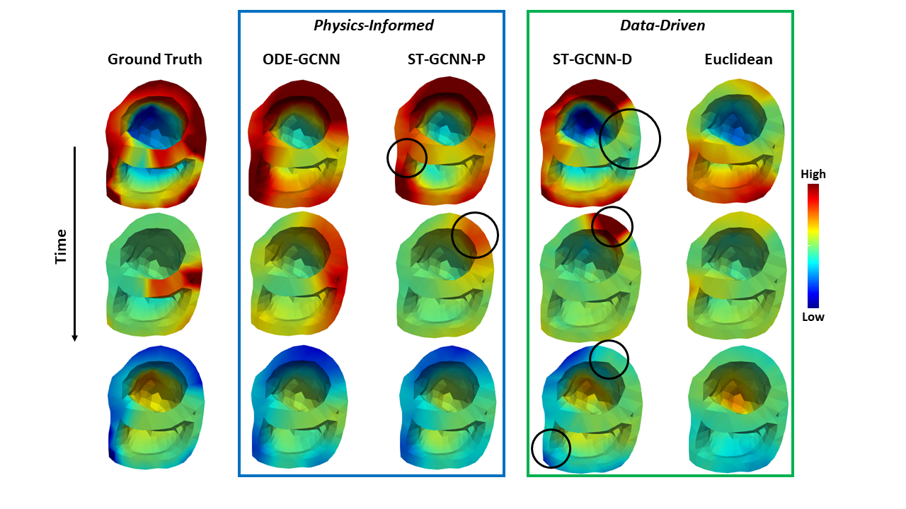
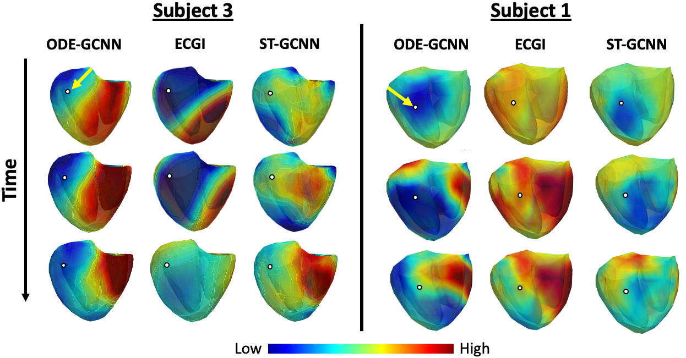
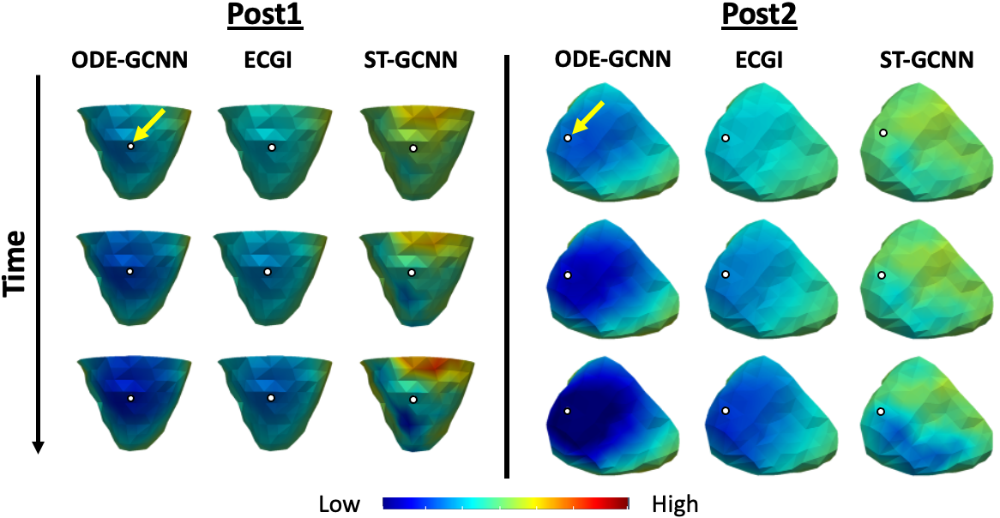

<h1 align='center'>Label-Free Physics-Informed Image Sequence Reconstruction with Disentangled Spatial-Temporal Modeling <br>
   [<a href='https://miccai2021.org/openaccess/paperlinks/2021/09/01/265-Paper1581.html'>MICCAI</a>, <a href='https://link.springer.com/chapter/10.1007%2F978-3-030-87231-1_35'>Paper</a>]</h2>
<p>This repository holds the experiments and models as explored in the work, "Label-Free Physics-Informed Image Sequence Reconstruction with Disentangled Spatial-Temporal Modeling." We provide guidance on training the models, as well as supplementary experiments and visualizations.</p>

# Running guidance

1. Check your cuda version. I've tested both `cu101` and `cu102`, and both of them are able to work.
2. Python version >= `3.8` would be recommended.
3. To install the python packages, change the variable `CUDA` in the script `req_torch_geo.sh`, then run it.
4. Check the configuration under `./config/`. Please use `seg04.json` for ODE-GCNN and `seg26.json` for ST-GCNN. Here are some important parameters:
   1. net_arch: the type of the network architecture
   2. ode_func_type: the function used for neural ODE
   4. seq_len: the length of the input time sequence
   5. latent_dim: the dimension of the latent feature
   6. cell_type: the type of modules for the correction step in temporal modeling
   7. nf: the number of the feature in each layer
   8. smooth: the smoothing parameter of the regularization term
5. To train the model, run the following command:
   ```bash
   python main.py --config seg04 --stage 1
   ```
6. To evaluate the model, run the following command:
   ```bash
   python main.py --config seg04 --stage 2
   ```

# Supplementary material

## Visualization for simulation experiments
Timelapse reconstruction for a single simulation case. Circled areas represent notable errors in reconstruction compared to ground truth.


## Visualization for clinical experiments
Healthy cases


Post-infarction cases

